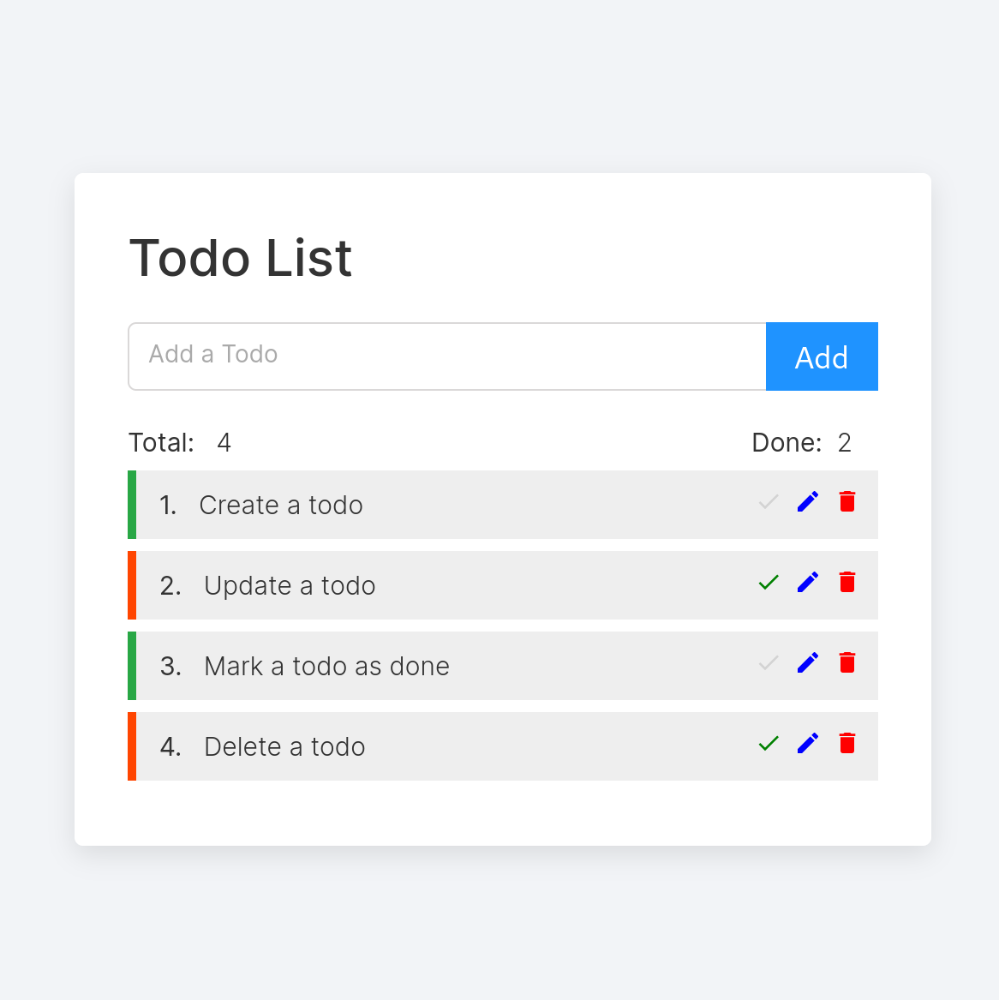

# Todo List

- A simple MERN stack web application: MongoDB + Express + ReactJS + NodeJS.

- CRUD implementation: Create, read, update & delete.

- Technologies used: react-icons/md, react-tooltip, react-toastify

### How to Use

It's designed to be simple and straightforward to use. And Tool Tips are in place to help. 

- Type in your todo task in the input field of the form, and then press the "Add" button to add the task to your todo list. Press the ENTER key works too. The input field can't be empty though, or you'll be greeted with a kind reminder to fill out the field. 

- Click on the green tick symbol to mark an todo as done, provided it's not done already. When an todo is marked as done, the green tick will turn gray. 

- To edit an existing todo, click on the blue pencil symbol. By doing this, the original content of the todo will be sent to the input field, where you make your changes. The "Add" button in this case will be changed to "Edit" correspondingly. Click on the "Edit" button to submit your changed todo and send it to the list. Done todos can be edited as well, and it'll be marked as undone after you have edited it. 

- To delete a todo, click on the red trash can symbol. 

- Each operation comes with react-toastify notifications. And two numbers are updated automatically: the total number of todos, and the number of done todos. 